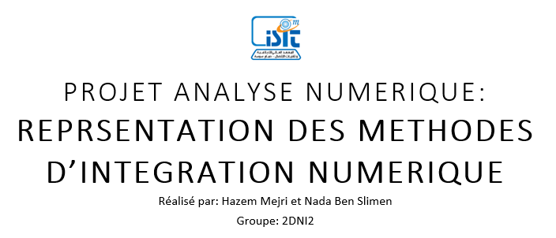

# Introduction:
***

- Si f est une fonction continue sur un intervalle <strong>[a,b]</strong>, bien souvent on ne sait pas calculer une primitive de f. Ainsi, si l'on désire obtenir la valeur de cette primitive, il faut parfois se contenter d'obtenir une valeur approchée à l'aide d'une méthode d'intégration numérique.
- La plupart des méthodes d'intégration numérique fonctionnent sur le même principe. On commence par couper le gros intervalle <strong>[a,b]</strong> en <strong>N</strong> plus petits intervalles. Puis, pour chaque intervalle <strong>[ai,ai+1]</strong>, on essaie d'approcher le primitive sur cet intervalle. 

# But:
***

Le but de notre projet est de réaliser une application desktop qui permet de représenter graphiquement des fonctions ainsi  que les méthodes d'intégration numériques .

>Les méthodes d’intégrations numériques qu'on a utilisé dans notre projet sont:
>- <strong>Méthode des réctangles</strong>
>- <strong>Méthode du point milieu</strong>
>- <strong>Méthode des trapèzes</strong>
>- <strong>Méthode de Simpson</strong>

# Partie théorique:

# Les méthodes d'intégration numériques:
***

## 1-Méthode des réctangles:

Dans cette méthode, on calcule l’intégrale numérique en réalisant une somme de surfaces de rectangles. Le domaine d’intégration est découpé en intervalles et on fait comme si la fonction restait constante sur chaque intervalle.

Sur chaque intervalle, on réalise ainsi l’approximation suivante :

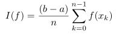

- **La méthode des rectangles à gauche**:

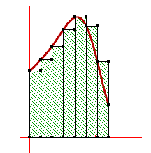

- **La méthode des rectangles à droite**:

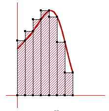

## 2-Méthode des trapèzes:

Comme son nom l’indique, cette méthode d’intégration utilise une somme de surfaces de trapèzes. Sur chaque intervalle, on réalise alors l’approximation suivante :

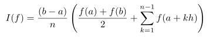

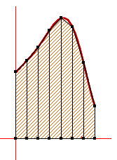

## 3-Méthode des points milieux:

Cette méthode utilise également le polynôme constant pour
approximer la fonction f. Cependant, elle exploite mieux les
symétries du problème en choisissant la valeur milieu

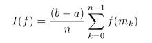

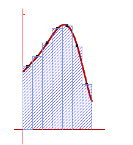

## 4-Méthode de Simpson:

Pour approximer la fonction f, cette méthode utilise le polynôme de degré 2 (la parabole) qui passe par
les trois points f0 = f(a), f1 = f((a+b)/2) et f 2 = f(b) :

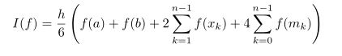

# Partie pratique:
***

### - **Première interface**:

Cette interface est l'interface d'acceuil


### - **Deuxième interface**:

C'est l'interface où vous pouvez configurer votre fonction. 
>- <strong>N: </strong> c'est le nombre de subdivison [0,10]
>- <strong>A et B: </strong> sont les deux bornes
>- <strong>xLabel: </strong> c'est le nom de l'axe des abcisses
>- <strong>yLabel: </strong> c'est le nom de l'axe des ordonnées

>- <strong>Bouton 'Select color' </strong>: Vous pouvez aussi choisir la couleur de la courbe de votre fonction
>- <strong>Bouton 'Generate' </strong>: Ce bouton permet la simulation

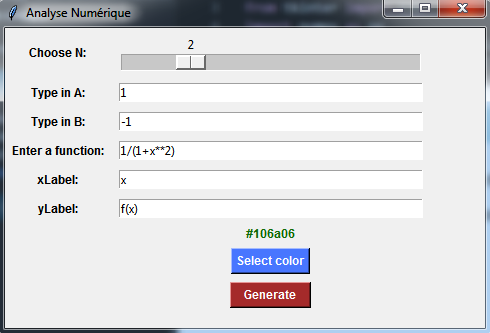

### - **Troixième interface**:

Si vous avez faites la configuration de votre fonction et vous cliquez sur le bouton 'Generate', la figure de votre fonction apparaitra comme cette figue ci-dessous:

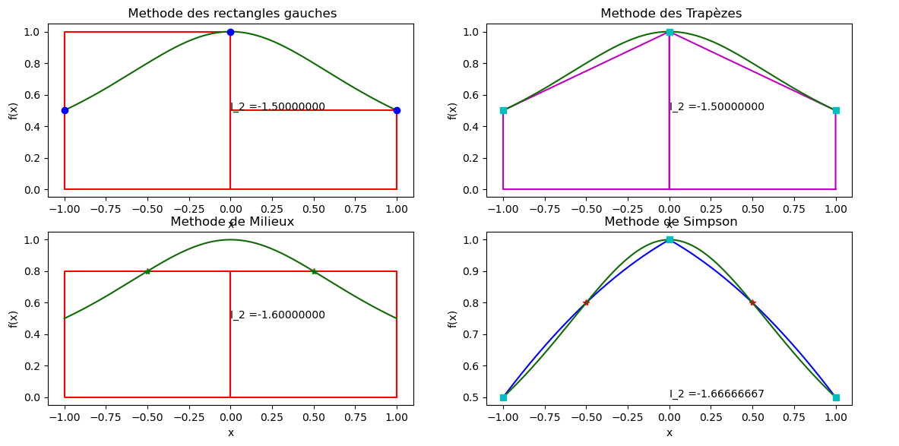

# Perspectives:
***

On peut ajouter quelques autres fonctionalités à cette application:

>- Calcul de la <strong>valeur de l'intégrale</strong> de la fonction saisie.
>- Calcul de <strong>la dérivé</strong> de la fonction saisie.


```python

```
